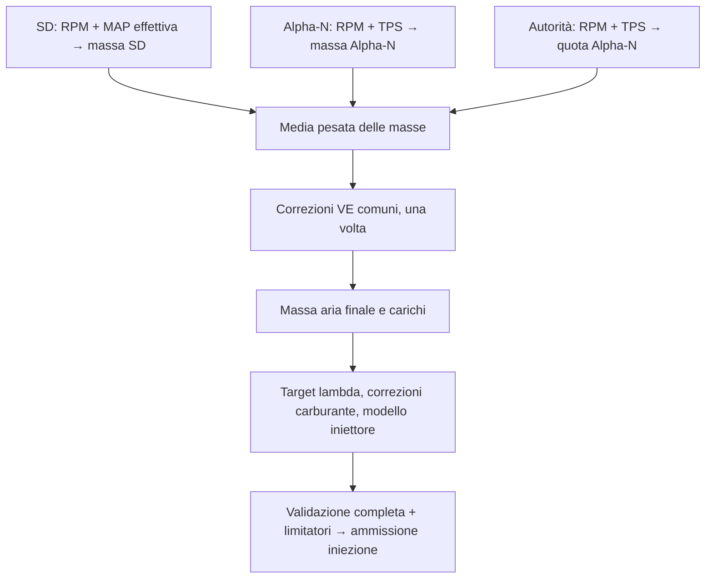

# Guida alle mappe aria indipendenti e al blending SD + Alpha-N

Questa guida descrive i controlli introdotti dalla patch `feature/blended-airmass`
per chi configura FOME con TunerStudio. I nomi tra virgolette sono quelli
nell'interfaccia inglese; i nomi in codice permettono di riconoscere i parametri
in un MSQ o in un log. Il riferimento è l'implementazione fino a `7170c8f175`,
presente anche nel branch aggiornato con upstream a `56d81f0744`.

## Indice

- [Scegliere il modo di funzionamento](#1-scegliere-il-modo-di-funzionamento)
- [Dove trovare controlli e schede](#2-dove-trovare-controlli-e-schede)
- [Mappe, assi e risoluzione](#3-mappe-assi-e-risoluzione)
- [Come si combinano modelli e correzioni](#4-come-si-combinano-modelli-e-correzioni)
- [Interazioni con i controlli precedenti](#5-interazioni-con-i-controlli-precedenti)
- [Continuare a operare come prima](#6-continuare-a-operare-come-prima)
- [Usare una strategia con mappa indipendente](#7-usare-una-strategia-con-mappa-indipendente)
- [Preparare e attivare SD + Alpha-N](#8-preparare-e-attivare-sd--alpha-n)
- [Arresto, guasti, riarmo e ritorno a standalone](#9-arresto-guasti-riarmo-e-ritorno-a-standalone)
- [Diagnostica e log](#10-diagnostica-e-log)
- [Problemi frequenti](#11-problemi-frequenti)
- [Compatibilità e riferimenti](#12-compatibilità-e-riferimenti)

## 1. Scegliere il modo di funzionamento

La patch offre tre possibilità. **Attivare le mappe indipendenti non attiva il
blending**: questo richiede una scelta separata in “Fuel strategy”.

| Uso | Fuel strategy | Dedicated airmass tables | Mappa usata per la massa aria |
| --- | --- | --- | --- |
| Comportamento precedente | Speed Density, Alpha-N o MAF Air Charge | `false` | La vecchia `veTable`, condivisa tra le strategie |
| Strategia singola con mappe indipendenti | Speed Density, Alpha-N o MAF Air Charge | `true` | La mappa propria della strategia selezionata |
| Combinazione SD + Alpha-N | SD + Alpha-N | `true`, obbligatorio | Mappe SD e Alpha-N, pesate dalla tabella di autorità |

La strategia Lua rimane disponibile con il suo comportamento precedente; non
viene introdotta una nuova mappa Lua. I numeri delle strategie esistenti non
cambiano: SD = 0, MAF = 1, Alpha-N = 2, Lua = 3; SD + Alpha-N aggiunge il valore 4.
MAF rimane una strategia singola: non partecipa al nuovo blending.

Per **standalone** si intende una strategia singola, sia con mappa condivisa sia
con mappa indipendente. Le dichiarazioni di prontezza e il nuovo blocco di
ammissione dell'iniezione riguardano il funzionamento composito. Un guasto già
memorizzato dal composito può però continuare a bloccare l'iniezione dopo un
cambio di strategia, fino al riarmo da fermo.

## 2. Dove trovare controlli e schede

### 2.1 Selezione generale

In **Base Engine → Base engine**, sezione **Fuel**:

| Controllo | Parametro | Funzione e condizioni |
| --- | --- | --- |
| Fuel strategy | `fuelAlgorithm` | Seleziona il modello. Modificabile offline o online a RPM visualizzati pari a zero. |
| Dedicated airmass tables | `useDedicatedAirmassTables` | Separa le mappe delle tre strategie. Predefinito `false`. Per abilitarlo, impostare prima l'override VE a `None`; modificabile offline o a RPM zero. |

“Dedicated airmass tables” compare anche nella scheda di blending: **è lo stesso
parametro**, non un secondo consenso. Il controllo consente di disabilitare le
mappe indipendenti anche se un import ha lasciato un override incompatibile.

In **Fuel → Injection configuration**:

| Controllo | Effetto della patch |
| --- | --- |
| Override legacy VE table load axis (`veOverrideMode`) | Nuovo nome del precedente override VE. Editabile solo con mappe indipendenti disabilitate. Con mappe indipendenti, deve essere `None`. |
| Alpha-N uses IAT density correction (`alphaNUseIat`) | Disponibile sia in Alpha-N standalone sia in SD + Alpha-N; agisce sul ramo Alpha-N. |
| Override AFR table load axis (`afrOverrideMode`) | Rimane disponibile; seleziona il carico della lambda e dello staging, senza cambiare gli assi delle mappe aria. |

Il selettore **Ignition → Ignition settings → Override ignition table load
axis** (`ignOverrideMode`) rimane indipendente da quello AFR.

### 2.2 Editor nel menu Fuel

Le condizioni sotto presuppongono **Injection configuration → Enabled** attivo.
Una voce o un pannello inattivo non indica che la mappa sia stata cancellata.

| Scheda | Quando è disponibile | Contenuto |
| --- | --- | --- |
| Shared VE / Speed Density VE | Mappe indipendenti disabilitate; oppure SD/composito con mappe indipendenti e override VE `None` | Editor della vecchia `veTable`, ora riservata a SD quando si usano mappe indipendenti |
| Alpha-N filling | Alpha-N/composito, mappe indipendenti, override VE `None` | Nuova mappa Alpha-N 16 × 16 |
| MAF correction | MAF, mappe indipendenti, override VE `None` | Nuova mappa di correzione MAF 16 × 16 |
| SD + Alpha-N blending | Iniezione abilitata, anche prima di selezionare il composito | Consensi, stato, riarmo e tabella di autorità 8 × 8 |

Le condizioni valgono anche per i pannelli già aperti: cambiando strategia non
si deve continuare a interpretare il cursore di un editor inattivo. Per preparare
una mappa standalone diversa da quella selezionata, cambiare strategia a motore
fermo o lavorare offline. Aprire “SD + Alpha-N blending” non seleziona da solo
quella strategia.

### 2.3 Controlli della scheda SD + Alpha-N blending

| Controllo | Parametro | Significato |
| --- | --- | --- |
| Dedicated airmass tables | `useDedicatedAirmassTables` | Stesso interruttore della configurazione generale; richiesto dal composito |
| SD map and MAP load tables ready | `sdAirmassMapReady` | Si dichiara che la mappa SD **e le tabelle a valle basate su MAP** sono calibrate per la zona prevista |
| Alpha-N map ready | `alphaNAirmassMapReady` | Si dichiara che la mappa Alpha-N è calibrata per il contributo previsto |
| MAP estimate calibrated | `mapEstimateReady` | Si dichiara che la tabella TPS/RPM di stima MAP è calibrata; serve quando il composito deve valutarla |
| Injection state | `blendedStatus` | Stato effettivo dell'ammissione dell'iniezione; sola lettura |
| Latched fault | `blendedFault` | Prima causa memorizzata del blocco; sola lettura |
| Rearm after stopping | Comando `rearm_airmass` | Richiede il riarmo dopo l'arresto; non calibra e non corregge la configurazione |

I tre consensi di calibrazione partono da `false` e sono editabili offline o a
RPM zero. Sono dichiarazioni dell'operatore: il firmware controlla la validità
numerica, ma non può stabilire se i valori descrivano correttamente il motore.
I consensi SD e Alpha-N sono **entrambi obbligatori anche con autorità tutta a
0% o tutta a 100%**. Quello della stima MAP può rimanere `false` se la stima non
serve mai nelle condizioni configurate.

Il pulsante di riarmo è abilitato solo online e a RPM visualizzati pari a zero.
Il firmware verifica inoltre stato realmente fermo, assenza di denti recenti e
completamento dei comandi d'iniezione già accettati. Il pulsante visibile e
abilitato non garantisce che queste condizioni siano già soddisfatte.

## 3. Mappe, assi e risoluzione

Tutte le mappe seguenti hanno RPM sulle colonne. Gli assi devono essere
strettamente crescenti, senza punti duplicati. Il numero di celle è fissato nel
firmware: TunerStudio permette di cambiare punti degli assi e valori, non di
ridimensionare la matrice.

| Mappa | Dimensione | Asse delle righe | Celle | Valori iniziali |
| --- | --- | --- | --- | --- |
| Shared VE / Speed Density VE | 16 × 16 | Condivisa: carico della strategia/override; dedicata SD: MAP effettiva in kPa | VE o coefficiente del modello selezionato, passo 0,1% | Mappa precedente/preset |
| Alpha-N filling | 16 × 16 | TPS 0–100%, risoluzione memorizzata 0,01% | Riempimento di riferimento, passo 0,1% | 80% come segnaposto |
| MAF correction | 16 × 16 | Riempimento relativo **prima** della correzione, 0–1000%, passo 1% | Moltiplicatore percentuale, passo 0,1%; 100% è neutro | 100% come segnaposto |
| SD + Alpha-N authority | 8 × 8 | TPS 0–100%, risoluzione 0,01% | Quota Alpha-N 0–100%, passo memorizzato 1% | 0% ovunque |

Gli assi RPM delle mappe dedicate e dell'autorità hanno passo memorizzato 1 RPM
e intervallo 0–18000 RPM. Le celle delle mappe aria accettano 0–999%; ciò esprime
il limite dell'editor, non un intervallo di calibrazione consigliato. La vecchia
mappa SD conserva asse di carico intero 0–1000. L'interpolazione può produrre
valori intermedi anche quando le celle sono memorizzate con passo intero.

**Questa patch aggiunge le mappe principali indipendenti da 16 × 16 e l'autorità
da 8 × 8. Le quattro vecchie VE blend tables rimangono da 8 × 8.** Non occorre
trasformare una tabella di correzione nella mappa principale Alpha-N.

### Significato fisico delle celle

- **SD:** il firmware usa VE, MAP effettiva, temperatura della carica e cilindrata
  per ricavare la massa aria per cilindro.
- **Alpha-N:** la cella descrive il riempimento rispetto al riferimento del
  modello, a 101,325 kPa. La temperatura è fissa a 20 °C oppure deriva da IAT,
  secondo `alphaNUseIat`. La cella non rappresenta la stessa grandezza della VE SD.
- **MAF:** si parte dall'aria misurata dal debimetro. Una cella a 110% moltiplica
  quella massa per 1,10, prima delle ulteriori correzioni previste. L'asse non
  usa il riempimento già corretto, evitando che la stessa correzione sposti
  circolarmente il proprio punto di lettura.
- **Autorità:** stabilisce quanto contribuisce ciascuna massa. Una cella a 50%
  non significa 50% di VE, né 50% di apertura iniettore.

I tre set di assi sono indipendenti; non è necessario che i punti RPM o TPS
coincidano. Per conservare una vecchia calibrazione bisogna copiare **la matrice
e i due assi**, mantenendo l'orientamento righe/colonne.

Parametri MSQ: SD usa `veTable`, `veLoadBins`, `veRpmBins`; Alpha-N usa
`alphaNTable`, `alphaNTpsBins`, `alphaNRpmBins`; MAF usa `mafTable`,
`mafLoadBins`, `mafRpmBins`; l'autorità usa `airmassBlendTable`,
`airmassBlendTpsBins`, `airmassBlendRpmBins`.

## 4. Come si combinano modelli e correzioni



Con `w = autorità / 100`:

```text
massa grezza = (1 − w) × massa SD + w × massa Alpha-N
massa finale = massa grezza × moltiplicatore delle correzioni VE comuni
```

A 0% si valuta solo il ramo SD; a 100% solo il ramo Alpha-N; tra i due estremi
si valutano entrambi. I requisiti comuni di configurazione e di carico restano
validi anche agli estremi. Non esiste una commutazione automatica verso il ramo
ancora funzionante dopo un guasto del ramo richiesto.

Esempio numerico: SD = 300 mg, Alpha-N = 400 mg, autorità = 25% producono
325 mg. Una correzione VE comune di +10% porta a 357,5 mg. Sono numeri per
illustrare il calcolo, non valori da inserire nella calibrazione.

### Le precedenti VE blend tables 1–4

Restano nel menu **Fuel → VE blend tables**, con i rispettivi pannelli “bias”.
Ogni coppia conserva:

- **Blend parameter:** canale che legge la curva di bias; `Zero` disabilita
  quella correzione.
- **Bias:** percentuale del valore della tabella di correzione da applicare.
- **Y axis override (set Zero for no override):** carico della tabella;
  `Zero` usa il carico predefinito, che nel composito è MAP effettiva.
- **VE blend table 1–4:** correzione percentuale da pesare con il bias.

Una cella +10 con bias 50 dà +5%, quindi un fattore 1,05. In standalone questo
fattore agisce sulla VE utilizzata; nel composito agisce sulla massa combinata,
una sola volta. Due correzioni +5% e +10% danno `1,05 × 1,10 = 1,155`.
Nessuna delle quattro tabelle sostituisce la nuova autorità SD/Alpha-N.

Nel composito, un canale richiesto non valido o una correzione non valida
produce un guasto `Correction`. Un override `MAP` di queste correzioni richiede
MAP misurata, anche se la MAP effettiva è stimata. I canali “Fuel Load” e
“Ignition Load” usano l'ultimo valore pubblicato dal calcolo precedente;
non leggono un risultato parziale del blending corrente.

## 5. Interazioni con i controlli precedenti

### 5.1 Quale carico usa ciascuna funzione

In standalone il carico nativo rimane quello precedente: MAP per SD, TPS per
Alpha-N, riempimento non corretto per MAF. L'override VE cambia la lettura della
mappa condivisa, non trasforma tutte le altre funzioni in tabelle con lo stesso
asse.

**Nel composito `fuelingLoad` è sempre MAP effettiva in kPa, anche a 100%
Alpha-N.** L'autorità cambia la massa, senza far scorrere il significato del
carico da kPa a TPS. Alcuni indicatori precedenti conservano un’etichetta `%`:
nel composito il valore di Fuel Load va comunque interpretato in kPa.

| Funzione esistente | Coordinata usata nel composito | Cosa verificare |
| --- | --- | --- |
| Fase iniezione, trim carburante per cilindro, regioni STFT | `fuelingLoad`, MAP effettiva | Assi e soglie prima eventualmente calibrati in TPS |
| Lambda monitoring / Maximum Lambda Deviation | `fuelingLoad`, MAP effettiva | Non segue l'override AFR |
| Target lambda / Target Gas-Scale AFR | Carico selezionato da `afrOverrideMode` | Target e asse restano comuni ai due modelli |
| Staged injection % table | Stesso carico del target lambda | L'override AFR cambia anche la coordinata dello staging |
| Anticipo principale, correzioni e trim accensione, knock | `ignitionLoad`, secondo `ignOverrideMode` | L'override accensione è indipendente da quello AFR |
| VVT con asse di carico predefinito | `fuelingLoad` | Gli eventuali selettori espliciti VVT restano propri della funzione |
| Trailing spark advance | `fuelingLoad` nel calcolo attuale | L'editor precedente mostra un cursore `ignitionLoad`: se i due carichi differiscono, quel cursore non rappresenta la coordinata effettivamente letta |
| GPPWM “Fuel Load” / “Ignition Load” | Rispettivamente carico carburante / accensione | Ricontrollare tutte le funzioni configurate per leggere questi canali |
| HPFP Target Fuel Pressure | MAP **misurata** | La stima MAP non soddisfa questa dipendenza |

Le opzioni AFR/accensione si risolvono separatamente:

| Selettore | Fonte nel composito |
| --- | --- |
| None / predefinito | MAP effettiva in kPa, eventualmente stimata |
| MAP | MAP misurata in kPa; nessun ripiego sulla stima |
| TPS | TPS in percentuale |
| Accelerator pedal | Posizione pedale in percentuale |
| Cylinder filling | Riempimento normalizzato dalla massa aria finale, dopo le correzioni VE comuni |

Un selettore introduce la dipendenza dal sensore scelto. Se manca il pedale,
selezionarlo per la lambda o l'accensione provoca un guasto di carico. Impostare
entrambi gli override a TPS non elimina il requisito di MAP effettiva del
composito: le altre funzioni continuano a usare `fuelingLoad`.

La patch aggiorna i cursori degli editor SD/Alpha-N, trim carburante, lambda/AFR,
staging e lambda monitoring alla rispettiva coordinata. Il cursore HPFP usa MAP
misurata anche in standalone. Nel composito `blendedLambdaLoad` conserva il
valore a piena precisione per lambda e staging; il vecchio diagnostico
`afrTableYAxis` satura oltre 655,35 e non deve essere usato per ricostruire quel
valore. Non ci sono due target lambda o due mappe di accensione da miscelare.

### 5.2 MAP estimate e transitori

La precedente **Fuel → MAP estimate table** resta una stima di pressione
in kPa da TPS e RPM, distinta dalla mappa di riempimento Alpha-N. È una mappa
16 × 16 (`mapEstimateTable`, `mapEstimateTpsBins`, `mapEstimateRpmBins`), con
celle 0–600 kPa a passo 0,01 kPa e assi TPS/RPM crescenti. `mapEstimateReady`
non cambia i dati della tabella e non ne forza l'uso permanente.

| Condizione nel composito | Comportamento |
| --- | --- |
| MAP misurata valida, nessuna selezione transitoria attiva | Usa MAP misurata; una stima inutilizzata non richiede il consenso |
| MAP assente/non valida | Richiede stima utilizzabile, TPS valido e `MAP estimate calibrated = true` |
| “Use MAP estimate during transient” attivo e soglia di accelerazione superata | Confronta MAP misurata e stimata, prendendo la maggiore; richiede una stima valida e dichiarata pronta anche se vince quella misurata |
| Override AFR/accensione/correzione esplicitamente MAP, o HPFP configurata | Rimane necessaria MAP misurata per quella funzione |

“Use MAP estimate during transient” è nel pannello **Fuel → Acceleration
enrichment**; ora è disponibile anche per SD + Alpha-N. Le regole precedenti
di fallback standalone sono conservate: il nuovo consenso della stima riguarda
il composito. Il composito valida i dati richiesti più rigorosamente e non
promette lo stesso comportamento degradato di una strategia standalone.

### 5.3 Temperatura, barometrica e altre correzioni carburante

- **Charge temperature estimation** alimenta il ramo SD. Al 100% Alpha-N quel
  ramo non viene valutato, ma possono restare dipendenze termiche nelle altre
  correzioni.
- **Alpha-N uses IAT density correction** usa IAT nel modello Alpha-N se attivo;
  altrimenti usa 20 °C. Nel composito, quando il ramo Alpha-N contribuisce e
  l'opzione è attiva, IAT deve essere valida. Lo standalone conserva il suo
  precedente fallback a 20 °C.
- **IAT multiplier**, **CLT multiplier**, correzione post-avviamento e
  **Barometric pressure correction** rimangono nel calcolo del carburante.
  Il menu barometrico è ora disponibile anche nel composito; la correzione
  agisce sul carburante risultante anche a 100% Alpha-N. La correzione
  IAT della densità e il moltiplicatore carburante IAT sono due effetti diversi:
  rivederli insieme per evitare di compensare due volte lo stesso fenomeno.
- Portata iniettori, dead time, correzione piccoli impulsi, trim e controllo
  lambda continuano a operare sul carburante risultante. Calibrare prima le
  masse e i target; l'autorità non sostituisce questi controlli.

### 5.4 Minimo, avviamento, limitatori e VE Analyze

| Controllo/funzione | Standalone con mappe indipendenti | SD + Alpha-N |
| --- | --- | --- |
| Idle → Idle settings → Use idle VE table (`useSeparateVeForIdle`) | Conserva la tabella condivisa Idle VE e il raccordo precedente | Deve essere `false`; entrambe le mappe principali devono coprire il minimo |
| Override Idle VE table load axis | Continua a valere per Idle VE | Inutilizzato perché Idle VE deve essere disabilitata |
| Regolazione aria/anticipo minimo | Rimane operativa | Rimane operativa; disabilitare Idle VE non disabilita il controllo del minimo |
| Priming iniziale | Politica standalone precedente | Disabilitato; il riarmo non genera un prime |
| Carburante fisso di cranking, AE, aggiunte Lua | Funzioni precedenti | Non possono aggirare un blocco del nuovo stato d'iniezione |
| DFCO, limiti giri/duty, altre protezioni | Rimangono attivi | Rimangono attivi; `Ready` non garantisce iniezione se un altro limiter la taglia |
| VE Analyze | Mappa della strategia selezionata; richiede override VE `None` e Idle VE disabilitata | Disabilitato anche a 0% o 100% |

Con mappe condivise il comportamento precedente di VE Analyze è conservato.
Con mappe dedicate basta che Idle VE sia **configurata**, anche fuori dal minimo,
per disabilitare l'analisi della mappa principale. L'abilitazione nell'INI resta
soggetta alla disponibilità della funzione nella propria edizione di TunerStudio.

## 6. Continuare a operare come prima

1. Salvare MSQ e INI originali prima dell'aggiornamento; il formato della
   configurazione flash cambia e il vecchio contenuto binario non viene migrato.
2. Usare firmware e INI corrispondenti alla propria scheda.
3. A motore fermo, selezionare la precedente strategia standalone e impostare
   **Dedicated airmass tables = false**. Se si proviene da un guasto composito,
   completare anche il [riarmo](#9-arresto-guasti-riarmo-e-ritorno-a-standalone).
4. Prima di importare un vecchio MSQ non convertito, verificare esplicitamente
   quel `false`: un parametro assente dal file non azzera quello già nel progetto.
5. Importare il backup e controllare strategia, vecchia mappa `veTable`, entrambi
   gli assi, override VE/AFR/accensione, Idle VE e impostazioni hardware.
6. Eseguire Burn, riavviare la centralina e rileggere/salvare l'MSQ per verificare
   la configurazione persistita prima di mettere in funzione il motore.

Le nuove mappe e l'autorità non intervengono in questa modalità. I consensi
possono restare `false`. La memoria per le nuove mappe è comunque riservata dal
firmware: disabilitare la funzione ripristina il comportamento, non la dimensione
del firmware o del formato flash.

## 7. Usare una strategia con mappa indipendente

### Conversione di una calibrazione precedente

Il convertitore prepara le mappe senza attivare il composito. Dalla radice del
repository, usando l'INI effettivamente distribuito con il firmware target:

```sh
python3 misc/airmass_conversion/convert.py vecchia.msq dedicata.msq \
  --ini /percorso/pacchetto-firmware/fome_core8.ini
```

| Strategia originale | Risultato |
| --- | --- |
| SD | Mantiene `veTable` e i suoi assi come mappa SD |
| Alpha-N | Copia la vecchia matrice e i due assi nella mappa Alpha-N dedicata |
| MAF | Copia la vecchia matrice e i due assi nella mappa MAF dedicata |

Il file sorgente resta intatto. L'uscita mantiene la strategia, abilita le mappe
indipendenti, imposta override VE `None`, inizializza le altre mappe ai segnaposto,
l'autorità a zero e tutti i consensi a `false`. La vecchia mappa condivisa viene
conservata anche per Alpha-N/MAF: **non diventa per questo una calibrazione SD**.

Il convertitore accetta assi nativi e, per Alpha-N, l'override TPS equivalente.
Rifiuta gli altri override, schede diverse, valori non rappresentabili, assi
invalidi e file che contengono già mappe dedicate, anche se disabilitate. Usare
un nuovo nome di uscita. Non ripetere la conversione su un file già convertito;
per una seconda prova ripartire dal backup originale.

Importare a motore fermo, verificare matrice e assi della strategia selezionata,
Idle VE, lambda, accensione e hardware, poi Burn e rilettura dopo riavvio.
Le tre dichiarazioni di calibrazione non sono richieste per lo standalone.

### Preparazione manuale o secondo modello

Preparare matrice **e assi** della mappa desiderata prima di metterla in servizio.
È possibile lavorare offline e selezionare temporaneamente la strategia per
accedere all'editor. Per la conversione Alpha-N/MAF copiare la vecchia mappa prima
di riutilizzare `veTable` per SD. Non esiste una conversione universale da una
mappa SD in una Alpha-N tramite copia delle celle: cambiano coordinate e modello.

Con mappe indipendenti abilitate vengono validati gli assi Alpha-N **e MAF**, anche
se una delle due strategie è inattiva. Lasciare validi i punti predefiniti della
mappa inutilizzata; non azzerarne tutti gli assi. Una configurazione standalone
incompatibile può produrre un errore di configurazione FOME, distinto dal latch
composito e non risolvibile con il solo pulsante Rearm.

## 8. Preparare e attivare SD + Alpha-N

1. **Preparare i due modelli in standalone.** Calibrare SD e Alpha-N nelle zone
   in cui contribuiranno. Conservare log e backup distinti. La zona di transizione
   deve essere coperta da entrambi; includere il minimo nelle mappe principali.
2. **Rivedere i carichi a valle.** Nel passaggio da Alpha-N standalone, tabelle
   prima lette in TPS possono essere lette in kPa. Controllare tutte le funzioni
   della sezione 5; conservare TPS per lambda/accensione tramite i relativi
   selettori solo se corrisponde alla calibrazione desiderata.
3. **Preparare la stima MAP se prevista.** Compilare MAP estimate table da dati
   del motore; controllare fallback, uso transitorio e dipendenze da MAP misurata.
4. **A motore fermo**, con Dedicated airmass tables ancora `false`, impostare
   override VE `None`. Abilitare poi Dedicated airmass tables, impostare
   Use idle VE table `false` e scegliere `SD + Alpha-N`. Se le mappe dedicate
   sono già abilitate con override `None`, mantenerle abilitate.
5. **Dichiarare le calibrazioni pronte.** Impostare i consensi SD e Alpha-N a
   `true` solo dopo i controlli precedenti. Impostare quello della stima a `true`
   se il composito deve utilizzarla o confrontarla nei transitori.
6. **Preparare l'autorità RPM/TPS.** Definire zone SD a 0%, Alpha-N a 100% e un
   raccordo dove i due modelli sono calibrati. Considerare l'interpolazione tra
   celle: vicino al bordo di una zona entrambi possono contribuire. Non esiste
   una soglia TPS universale valida per ogni motore.
7. **Salvare e verificare la configurazione.** Burn, riavvio e rilettura secondo
   la normale procedura; verificare anche i nuovi consensi. Da fermo è normale
   vedere “Waiting for valid fuel”. Il consenso Ready richiede un nuovo calcolo
   completo con RPM positivi; non compare semplicemente spuntando i consensi.
8. **Durante le prove**, registrare autorità, masse, carichi, moltiplicatore,
   lambda, stato e fault. In sovrapposizione confrontare le masse, correggere
   prima le calibrazioni dei modelli, poi il raccordo. VE Analyze resta disabilitato.

Una prova a 0% serve a isolare il contributo SD; una a 100% quello Alpha-N.
**100% Alpha-N nel composito non equivale a scegliere Alpha-N standalone**:
restano MAP effettiva, consensi, politica dei guasti e priming disabilitato.
Masse uguali non garantiscono impulsi uguali se target lambda, carichi o
correzioni a valle differiscono.

Non cambiare strategia durante la rotazione. Le normali scritture live delle
mappe invalidano il calcolo in corso e richiedono un nuovo risultato valido;
una modifica che lascia assi o configurazione invalidi può memorizzare un guasto.
Preparare offline le modifiche strutturali agli assi e alle modalità.

## 9. Arresto, guasti, riarmo e ritorno a standalone

| Injection state | Codice | Significato operativo |
| --- | --- | --- |
| Standalone | 0 | Nessun consenso composito richiesto; valgono le normali condizioni di iniezione |
| Waiting for valid fuel | 1 | Nuove iniezioni inibite in attesa di un calcolo completo, corrente e valido a RPM positivi |
| Ready | 2 | Il composito ammette nuove iniezioni, soggette agli altri limitatori |
| Fault latched | 3 | Nuove iniezioni inibite; la causa iniziale resta memorizzata fino al riarmo |

In caso di guasto, gli impulsi già accettati terminano normalmente. Non vengono
avviate nuove sequenze o continuazioni split; non si cancellano le chiusure
pendenti degli iniettori. Ripristinare il sensore o cambiare strategia non
cancella da solo il latch.

### Procedura di recupero

1. Leggere e registrare **Latched fault** e il contesto del log.
2. Correggere il sensore, la configurazione o la calibrazione responsabile.
3. Arrestare il motore e attendere che non arrivino nuovi denti e che i comandi
   pendenti siano terminati. Lo zero sul contagiri da solo può precedere questo stato.
4. Premere **Rearm after stopping**, oppure inviare `rearm_airmass` dalla console.
5. Nel composito verificare **Waiting for valid fuel / None**; al successivo
   avviamento un calcolo valido deve portare a **Ready**. Se il difetto permane,
   il guasto viene nuovamente memorizzato.

Non serve un riarmo dopo ogni arresto normale in assenza di latch. Un riarmo
rifiutato va risolto verificando le condizioni di arresto, non forzando un cambio
di modalità. Un errore fatale generale della ECU segue la normale procedura FOME.

### Tornare a standalone

A motore fermo, scegliere SD, Alpha-N o MAF e verificare che la relativa mappa
contenga la calibrazione desiderata. Si possono mantenere le mappe indipendenti.
Se esiste un latch, eseguire il riarmo: ora lo stato atteso è **Standalone / None**.
Per tornare anche alla mappa condivisa, impostare Dedicated airmass tables `false`
e ripristinare la vecchia `veTable` con i due assi e gli override originali.
Disabilitare l'opzione **non ricopia** automaticamente Alpha-N o MAF in `veTable`.

## 10. Diagnostica e log

I nuovi canali sono riconoscibili dai nomi “Air blend: …”. Sono osservazioni del
calcolo; non sono ulteriori regolazioni.

| Parametro | Contenuto / unità |
| --- | --- |
| `blendedSdMass` | Massa SD grezza, mg in TunerStudio |
| `blendedAlphaNMass` | Massa Alpha-N grezza, mg in TunerStudio |
| `blendedRequestedAuthority` | Quota Alpha-N richiesta dall'interpolazione, % |
| `blendedEffectiveAuthority` | Quota effettiva del calcolo aria valido, % |
| `blendedSdLoad` | Coordinata SD catturata, kPa |
| `blendedAlphaNLoad` | Coordinata Alpha-N catturata, % TPS |
| `blendedSdVe` | Cella/interpolazione VE SD prima delle correzioni comuni, % |
| `blendedAlphaNVe` | Cella/interpolazione del riempimento Alpha-N prima delle correzioni comuni, % |
| `blendedCorrection` | Prodotto dei moltiplicatori delle quattro correzioni VE; 1 è neutro |
| `blendedStatus` | Stato di ammissione dell'iniezione, tabella precedente |
| `blendedFault` | Prima causa memorizzata, tabella seguente |
| `blendedFlags` | Bit di valutazione/validità, tabella sotto |
| `blendedLambdaLoad` | Carico lambda effettivamente risolto, unità del selettore AFR |

Le masse grezze escludono le correzioni VE comuni. Per confrontarle con la massa
finale, applicare autorità e `blendedCorrection`; non confrontarle direttamente
con la durata dell'iniezione. La massa finale è pubblicata nel canale precedente
`sdAirMassInOneCylinder`, il cui nome storico rimane anche per il composito;
`normalizedCylinderFilling` ne esprime il riempimento normalizzato.
Il trasporto binario delle due masse grezze usa grammi,
convertiti in mg dall'INI. Il vecchio indicatore di VE unica e il suo asse sono
azzerati nel composito: non indicano una perdita reale di riempimento.

### Latched fault

| Codice | Etichetta | Controlli iniziali |
| --- | --- | --- |
| 0 | None | Nessuna causa memorizzata; leggere comunque lo stato |
| 1 | Configuration | Mappe dedicate, override VE, Idle VE, consensi, assi e autorità; consenso della stima se richiesta |
| 2 | Sensor | TPS e ingressi richiesti dal ramo attivo, inclusa IAT se richiesta dall'Alpha-N |
| 3 | Correction | Sorgenti, assi e risultati delle correzioni VE comuni |
| 4 | Result | Risultato aria/carburante o pubblicazione finale non valido; controllare anche conversione lambda/AFR, correzioni carburante e dati di iniezione |
| 5 | Load | MAP effettiva, selettori lambda/accensione, dipendenza MAP misurata della HPFP |
| 6 | Strategy change | Passaggio da/verso composito mentre il motore non era completamente fermo o con comandi pendenti |
| 7 | Scheduling | Sequenza d'iniezione non accettabile o risorse del pianificatore insufficienti; conservare il log per diagnosi firmware |

Le righe sono una guida alla diagnosi, non una corrispondenza esclusiva tra un
sensore e un codice: la classificazione dipende dal punto del calcolo che ha
rifiutato il dato. Il motivo di taglio **Air model** (`fuelCutReason = 18`) indica
il blocco del nuovo controllo; gli altri motivi di taglio restano possibili.

### Calculation flags

| Valore del bit | Significato |
| --- | --- |
| 1 | SD valutato |
| 2 | Alpha-N valutato |
| 4 | Risultato SD valido |
| 8 | Risultato Alpha-N valido |
| 16 | MAP effettiva proveniente dalla stima |
| 32 | Calcolo della massa aria composita valido |
| 64 | Stima MAP valutata |

Esempi senza stima: 37 = SD valido a 0%; 42 = Alpha-N valido a 100%;
47 = entrambi validi. Un ramo non valutato può mostrare zero nei suoi canali:
quel valore è **indisponibile**, non una massa misurata pari a zero. Su un
calcolo aria fallito l'autorità effettiva viene azzerata: controllare il bit 32
prima di interpretarla come funzionamento SD puro. Il bit 32 non basta per
ammettere l'iniezione: serve lo stato Ready dopo la validazione del carburante
completo. Il canale precedente `fallbackMap` è utile solo se la stima è stata
valutata; il bit 64 non implica necessariamente il bit 16.

## 11. Problemi frequenti

| Sintomo | Verifica |
| --- | --- |
| Non posso abilitare Dedicated airmass tables | Fermare il motore; con l'opzione ancora disabilitata impostare l'override VE a None |
| Non vedo Alpha-N filling o MAF correction | Controllare iniezione abilitata, strategia selezionata, mappe dedicate e override VE None |
| VE Analyze non disponibile | In composito è previsto; in standalone dedicato verificare Idle VE disabilitata e mappa della strategia corrente |
| Configuration con autorità 0% | Anche a 0% occorrono entrambi i consensi; controllare inoltre Idle VE e assi, compresi quelli MAF inutilizzati |
| Guasto dopo aver abilitato MAP transitoria | Verificare tabella di stima, TPS e MAP estimate calibrated; servono anche quando MAP misurata vince il confronto |
| MAP stimata valida ma fault Load | Cercare override espliciti MAP e HPFP configurata; verificare anche gli altri selettori di carico |
| Sensore ripristinato, iniezione ancora tagliata | Il latch richiede arresto e riarmo; controllare anche i limitatori precedenti |
| Riarmo rifiutato a 0 RPM | Verificare trigger ancora in avviamento, denti recenti o comandi d'iniezione pendenti |
| Cambia la carburazione passando a 100% Alpha-N | Confrontare carichi a valle, target lambda, Idle VE, correzioni e impostazione IAT con lo standalone |
| Vecchia VE a zero nel log | Nel composito usare i diagnostici separati dei modelli |
| Vecchio MSQ importato, nuove opzioni ancora attive | I campi assenti non azzerano lo stato del progetto; disabilitare esplicitamente le mappe dedicate prima dell'import legacy |

## 12. Compatibilità e riferimenti

Usare sempre l'INI del pacchetto firmware per la scheda corretta. La patch cambia
il formato flash e aggiunge canali live: un vecchio INI non è adatto neppure se
si sceglie il comportamento legacy. Conservare backup prima dell'aggiornamento
e prima di convertire la calibrazione. Questa guida non certifica le impostazioni
hardware di un MSQ importato tra versioni diverse.

Le prove software, al banco Core8 e in TunerStudio sono descritte nel
[rapporto di validazione](../development/blended-airmass-validation.md).
La prova al banco non sostituisce la calibrazione sul motore o la verifica dei
segnali e delle uscite con carichi reali. Le funzioni TunerStudio provate e i limiti
della verifica sono indicati nel rapporto.

Riferimenti per approfondire:

- [Procedura e regole del convertitore](../../misc/airmass_conversion/README.md).
- [Contratto operativo del composito](../development/blended-airmass-operation.md).
- [Mappe dedicate standalone: dettagli di implementazione](../development/dedicated-airmass-tables.md).
- [Sorgente dell'interfaccia TunerStudio](../../firmware/tunerstudio/tunerstudio.template.ini).
- [Definizioni dei parametri](../../firmware/integration/fome_config.txt).
- [Calcolo composito](../../firmware/controllers/algo/airmass/blended_airmass.cpp).

Le note delle singole fasi di sviluppo conservano i risultati della relativa
fase; per l'uso attuale valgono questa guida e il rapporto finale di validazione.
